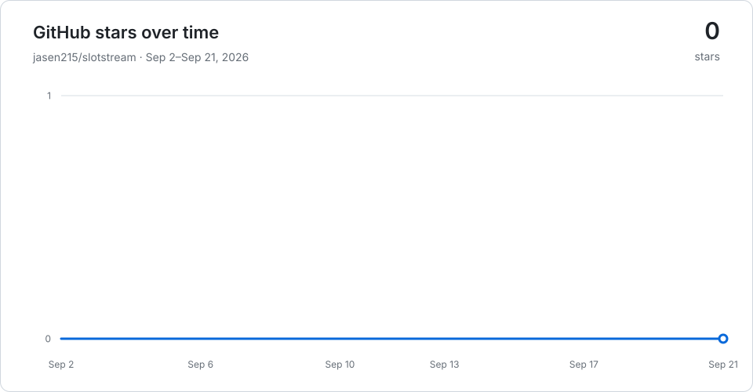

# slotstream

[](https://github.com/carloslfu/slotstream/releases/latest)
[](#star-history)

**Run a 105 GB AI model on a 48 GB Mac.**

Slotstream runs [Qwen3.8-Flash-Next](https://huggingface.co/pipenetwork/Qwen3.8-Flash-Next-MLX-4bit),
a large open model, on your Mac by keeping most of it on SSD and loading the
parts it needs into memory. It is built for Macs with 16 to 64 GB of memory,
where the model cannot fit. After a one-time download the model works
offline, with no Python and no cloud account. The whole engine is one native
Swift program on Apple's MLX and Metal; see [Built native](#built-native).

Use it to chat, ask about pictures, or work with files through a coding agent
such as Claude Code, Codex, Pi, opencode or Hermes. Developers can connect
their own apps through its APIs or Swift library.

[Get started](#install) · [Speed](#speed) · [Guides](#guides) · [Get help](#support)

> **I'm building Sevra on Slotstream: private, personal AI optimized for your computer.**
> Sevra will choose a tested model for your hardware, keep that choice current
> as models improve, and let you control what it remembers. The Mac app is in
> development and runs Slotstream in process; see
> [how it is built](docs/SEVRA-MAC.md) and
> [join the waitlist](https://www.sevrahq.com/). Slotstream's command-line
> tool, APIs and Swift library remain independently usable.

## Who it's for

Slotstream is built for Macs that cannot hold the model in memory: **16 to
64 GB**. That is where the engineering, the measurements and the defaults go,
so that frontier-class intelligence runs on the Macs most people already own.
It also runs on 96 GB and larger Macs, where the model fits in memory, but it
is not optimized for them: engines that keep the whole model in memory report
faster replies there. See
[related projects](docs/ENGINEERING.md#related-projects) if that is your Mac.

## Will it run on my Mac?

You need an **Apple Silicon Mac with at least 16 GB of memory, macOS 14 or
later, and about 110 GB of free SSD space**. Open About This Mac from the
Apple menu to check your chip and memory. On an 8 GB Mac even the smallest
memory plan doesn't fit, so Slotstream refuses to start instead of swapping.
Windows, Linux and Intel Macs are not supported. The
[hardware guide](docs/HARDWARE.md#what-you-need) has the tested macOS versions.

## Speed

`tok/s` means tokens per second; a token is a small piece of text, often part
of a word. Reply speeds below describe generation after the model has warmed up.

**Our development Mac, a 48 GB M5 Pro, measured 15.86 tok/s with 0.2.19 at a
22 GB memory target**, in a controlled benchmark on eight prompts the engine
was never tuned on. The engine predicts which experts the
next layers will need and reads them from the SSD before they are asked for,
which changes speed and never the output. The
[expert lookahead guide](docs/EXPERT-LOOKAHEAD.md) has the measurements behind
each release. This historical test used smaller prompt passes and disabled
prefix caching, leaving more memory for experts. It is not a measurement of
today's automatic configuration. A qualified full-answer baseline on 0.2.23
[is still pending](db/records/measurements/release-speed-calibration-2026-09-22.md).

<a id="speed-by-memory"></a>
<a id="speed-by-mac-memory"></a>

### What to expect by memory

Rough planning ranges for warm replies, from community reports and our own
measurements, rounded outward. Faster chips and SSDs sit at the top of each
range; other apps and memory pressure pull results down.

| Installed RAM | Estimated warm reply speed | Example automatic context window |
|---|---|---|
| 8 GB | **Support coming soon.** The current model doesn't fit yet. | Not available yet |
| 16–<24 GB | ~1–6 tok/s | 32,768 tokens |
| 24–<48 GB | ~6–16 tok/s | 32,768 through 32 GB; 65,536 at 36 GB |
| 48–<96 GB | ~15–27 tok/s | 32,768 at 48 GB; 131,072 at 64 GB |
| 96 GB+, the model fits in memory | ~20–32 tok/s | 262,144 tokens, the model's full window |

Context examples use decimal-GB memory simulations. A Mac's marketed capacity,
Metal limits and available memory can produce a different plan; `slotstream
doctor` shows the actual choice.

The middle rows are anchored on our M5 Pro's measurement; the top ends of the
last two rows come from a 128 GB M5 Max with a larger, manually chosen memory
target, and the last row is outside Slotstream's target range. These are
estimates, not limits. The hardware guide has the
[basis of each range](docs/HARDWARE.md#planning-ranges), every result
[measured on real Macs](docs/HARDWARE.md#results) with credits and test
conditions, and [every automatic memory plan](docs/HARDWARE.md#automatic-memory-plans).

### Recent prompt-processing results

The changes shipped in 0.2.23 shorten prompt processing and repeated-history
work. These measurements use the same 48 GB M5 Pro at a 10 GB target, with
three clean pairs per comparison:

| Workload | Matched control | Median times, control → enabled | Median paired time reduction |
|---|---|---|---|
| 16K inventory prompt, MTP on | Larger-read workspace policy off | 155.22 s → 53.94 s prefill | 65.40% |
| 2K prose follow-up, MTP off | Prefix checkpoints disabled | 30.73 s → 4.42 s request | 85.62% |

Both comparisons switch a feature off in the same tested binary. They measure
prompt processing or a cached follow-up, not an increase in reply tok/s or a
whole-release speedup. Times are arm medians; reductions are medians of paired
changes. The [hardware guide](docs/HARDWARE.md#recent-prompt-processing-results)
explains the fixtures and the latest audit's exclusions.

A fresh installed-release study used ordinary caching at the same memory
target. These are observed first-read ranges and median exact-repeat request
times across the prescribed request order, with capped replies:

| Prompt | Eligible first reads / repeats | First-read prefill range | Median repeated request |
|---|---:|---:|---:|
| 2K code | 4 / 3 | 13.86–28.11 s | 2.79 s |
| 2K prose | 3 / 3 | 14.91–26.51 s | 3.22 s |

The desktop load screen passed for the included observations, but several
runs had system swap-ins. Request history changed read batching, so these
results do not replace the general speed estimates or decode headline.
See the [measurement and its limits](db/records/measurements/release-prefill-2k-2026-09-22.md).

<a id="memory"></a>
<a id="context"></a>

### Memory and context

**Auto mode picks the memory target, cache size, speculative decoding and
context window for your Mac.** It takes the largest window in the table above
that still leaves room for speculative decoding and a complete conversation,
given the memory free at startup, without an unmeasured loss of useful
expert cache. `slotstream doctor` shows the choice and
why, and `--max-context 65536` sets a window yourself, up to 262,144 tokens.

**Starting a reply takes time.** Slotstream first reads your question and the
conversation history, which can take minutes for a long prompt. Follow-up
turns reuse unchanged history, a new conversation reuses the system prompt
earlier ones started with, and `serve --prefix-cache-dir` keeps long
conversations and shared system prompts on disk so that they survive a
restart. The hardware guide
has the [prompt-reading estimates](docs/HARDWARE.md#automatic-memory-plans)
for each memory size.

## Install

Open Terminal and paste this command:

```sh
curl -fsSL https://raw.githubusercontent.com/carloslfu/slotstream/main/install.sh | sh
```

Run the same command to update. If `slotstream` isn't found afterward, open
a new terminal window.

## Use it

Check your Mac, then ask for a first reply:

```sh
slotstream doctor
slotstream run --prompt "Why is the sky blue?"
```

<a id="downloading-the-model"></a>

`doctor` checks memory and disk space without loading the model. The first
`run` asks to download it, then prints a reply. This download can take hours,
but you only need to do it once. Interrupted downloads resume when you try
again. Follow the [step-by-step setup](docs/GETTING-STARTED.md) for more help.

<a id="chat-apps-and-the-api"></a>
<a id="pictures"></a>
<a id="coding-agents"></a>
<a id="docs"></a>

## Guides

| What would you like to do? | Guide |
|---|---|
| Chat in Open WebUI or another app | [Connect a chat app](docs/CLIENTS.md) |
| Ask about a picture | [Use an image](docs/GETTING-STARTED.md#ask-about-a-picture) |
| Start a coding agent on the model, in one command | [Use coding agents](docs/CODING-AGENTS.md) |
| Code with Claude Code | [Use Claude Code](docs/CLAUDE-CODE.md) |
| Code with Codex | [Use Codex](docs/CODEX.md) |
| Code with Pi or opencode | [Use Pi or opencode](docs/CODING-AGENTS.md#pi) |
| Work with files and tools through Hermes | [Use Hermes](docs/HERMES.md) |
| Code with fx, Vercel Labs' coding agent | [Use fx](docs/FX.md) |
| Fix a problem, move the model, or uninstall | [Troubleshooting](docs/TROUBLESHOOTING.md) |

Install chat apps and agents separately. They provide the interface and tools;
Slotstream runs the model. Keep its server running while a connected app uses it.
`slotstream launch claude` (or `codex`, `pi`, `opencode`, `hermes`) starts
that agent already connected, and starts the server in the background first
when none is running.

<a id="use-it-from-swift"></a>
<a id="testing"></a>
<a id="building-and-testing"></a>

For developers, the [engineering guide](docs/ENGINEERING.md) links to the
OpenAI- and Ollama-compatible API references, Swift library, command options,
build instructions, and tests. [Release notes](CHANGELOG.md) show what changed.

## How it works

Qwen3.8-Flash-Next is a *mixture-of-experts* model: generating each piece of
text uses only a subset of its expert networks. Slotstream keeps shared
weights in memory and reads the needed experts from SSD into a cache.
Frequently used experts stay in RAM, reducing repeated disk reads.

The whole model stays available even though it doesn't all fit in memory.
Slotstream chooses a memory target for your Mac and adjusts its cache as
other apps need room. Cache size changes speed without removing experts
from the model. The [engineering explanation](docs/ENGINEERING.md#how-it-works)
covers the implementation.

<a id="built-native"></a>

## Built native

Slotstream is one native Mac program: the command-line tool, the HTTP server,
the memory planner, the expert cache and the model itself are Swift on Apple's
MLX framework and Metal, with Slotstream's own Metal kernels compiled at run
time where a step needed one (the gated-delta recurrence, the selected
attention, the expert routing). No Python runtime or interpreter sits between
a request and the GPU.

That is deliberate. Built around one model on one kind of hardware, each layer
is tuned for the one below it: expert records are read from the SSD straight
into the cache slots the GPU computes from, the memory plan is checked against
what the process really uses, and a governor resizes the cache while other apps
need room. It is also why the engine ships as one file that installs with one
command, and why a Mac app such as Sevra can run it in process. The speed on
this page comes from measured mechanisms that this control allows, not from
the language itself; every published number has a recorded method in the
[measurements](MEASUREMENTS.md). The trade is that the engine runs only on
Apple Silicon; Windows and Linux are planned in Sevra with their own native
engines.

## Status and limits

- **Not optimized for 96 GB and larger Macs**, where the model fits in memory;
  see [Who it's for](#who-its-for).
- **One generation at a time:** connected apps share the same running model.
- **Conversation length is limited:** longer histories take more memory and
  time. Auto mode picks a [window for each memory size](#speed-by-memory), and
  the coding agent guides include the larger window agents need.
- **No broad benchmarks yet:** image input and tool calling have integration
  tests, but there is no image-accuracy benchmark or completed comparison with
  other models on the same Mac.

## FAQ

### Does it work offline?

Yes, after downloading the model. Inference runs on your Mac. Connected
agents may still use internet services for web searches or other tools;
their settings determine what those tools send.

### Why doesn't Slotstream use all of my RAM?

`--memory-gb 48` is a maximum process budget, not a promise to keep 48 GB
resident. Slotstream allocates the expert cache at load, while conversation
state and temporary work grow only when a request needs them. A short request
can therefore peak well below the target. The startup report shows the budget,
expert cache, runtime allowances and safety headroom separately.

Without an explicit target, Auto uses a **33 GB** base ceiling, or **34.6 GB**
with speculative decoding at the 32,768-token window. This measured default
leaves memory for other apps. To use more, stop any running server and preview
the plan without loading the model:

```sh
slotstream doctor --memory-gb 40
```

If it fits with headroom, `slotstream serve --memory-gb 40` uses that budget
with a fixed cache. In the current development version, use
`--memory-limit-gb` instead to choose an upper limit while the cache adapts
to other apps. Custom limits can exceed the automatic default; the Mac's
supported budget and available memory still bound actual use.
Auto keeps expert cache when a larger automatic context would trade it away
without a measured benefit. Use `--max-context N` when you explicitly want a
longer window. Leave room for macOS and other apps. See the
[memory options](docs/CLI.md#memory-options) for details.

### Is Slotstream the fastest way to run this model?

On a Mac that cannot hold the model, 16 to 64 GB, it is the way to run it at
all, and the engineering goes into making that fast. On 96 GB and larger Macs
the model fits in memory and engines that keep it there report faster replies.
See [Who it's for](#who-its-for) and
[related projects](docs/ENGINEERING.md#related-projects).

### Why is it written in Swift and not Python?

The engine needs direct control of memory, disk reads and the GPU, and it
has to ship as one file that a Mac app can call in process. Swift on MLX and
Metal gives that; a Python runtime would put an interpreter and a second
process in the way. The Python in the repository is tooling (the reference
model the port is checked against, benchmark drivers, release checks), and
none of it runs when you use Slotstream. See [Built native](#built-native).

### Will this wear out my SSD?

Generation reads the model files without rewriting them. macOS swap adds
writes when memory runs short. Automatic memory sizing helps, but a small
Mac or an oversized manual setting can still swap heavily. With
`serve --prefix-cache-dir`, Slotstream also saves long conversations to that
folder after each reply, and the system prompts conversations share, within a
disk quota.

### Can I run it on Linux or Windows?

Support for AMD and NVIDIA on Windows and Linux is planned for Sevra.
It isn't available in the current Slotstream engine.

<a id="related-projects"></a>

### Can I use a different model?

Not with Slotstream today. Its loader and memory planner are built for this
model. See [related projects](docs/ENGINEERING.md#related-projects) for runtimes
with different model and hardware support.

## Why this exists

I wanted to run this model on my own Mac, but the standard loader exhausted
memory before producing a reply. Slotstream grew out of that experiment.
The [published measurements](MEASUREMENTS.md#m07--the-naive-path-fails-why-slotstream-exists)
include that failed load and the experiments that followed.

The project was also [discussed on Hacker News](https://news.ycombinator.com/item?id=49524447).
The questions and hardware reports from that discussion help guide the work.

## Support

[Report a bug](https://github.com/carloslfu/slotstream/issues/new) if something
doesn't work, or [share your Mac's results](docs/HARDWARE.md#how-to-measure)
to help others know what to expect. Reports are credited to their authors.
Code and documentation contributions are welcome; see
[Contributing](CONTRIBUTING.md) for the workflow.

## Grants and sponsors

<p>
  <a href="https://github.com/rauchg">
    <br>
    <strong>Guillermo Rauch</strong>
  </a>
</p>

Slotstream was selected for [Guillermo Rauch's personal grants for foundational
open-source software](https://rauchg-oss-grants.vercel.app/).
Thank you for supporting its development.

## Who made this

I'm [Carlos Galarza](https://www.carlosgalarza.com). I build local AI and
make it run efficiently on the computers people already own. Slotstream is
the engine, written natively for the Mac and tuned as one system, and
[Sevra](https://www.sevrahq.com/) is the private AI app I'm building on it.
I also help teams run open models on their own hardware and debug agent
workflows. For help or consulting, [email me](mailto:carloslfu@gmail.com).

## Star history

<picture>
  <source media="(prefers-color-scheme: dark)" srcset="docs/assets/star-history-dark.svg">
  
</picture>

The badge at the top shows the latest star count; this chart is updated weekly.

## License

Slotstream is [MIT-licensed](LICENSE). The model weights have their own
[Qwen community license](https://huggingface.co/pipenetwork/Qwen3.8-Flash-Next-MLX-4bit/blob/main/LICENSE).
See [credits](docs/ENGINEERING.md#credits) for the model and code this project builds on.
